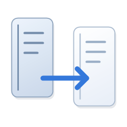

# 内容迁移

选中文字，右键点“内容迁移”，附上备注，将原文、标题和出处追加到桌面的 `内容迁移.txt`。

## 下载与安装

**[下载 Windows 安装程序](https://github.com/guiii007/-/releases/latest/download/ContentMoverSetup.exe)**

下载后双击安装程序，按“下一步 → 安装 → 完成”即可。默认创建桌面快捷方式，可选择开机自动启动。适用于 Windows 10/11 x64，使用系统自带的 .NET Framework 4.x。



## 使用

1. 在浏览器、Word 或 AI 客户端中选中文字，点击鼠标右键。
2. 点击原菜单旁的“内容迁移 ↗”按钮。没有选中文字时不显示。
3. 核对标题、出处，填写备注，点“保存到 TXT”。每次追加，不覆盖已有摘录。

安装桌面软件即可使用，无需安装浏览器扩展。快捷键 **Ctrl+Alt+M** 也可触发摘录。无法自动读取选区时，可先 **Ctrl+C** 再使用快捷键；兼容模式需要核对预览并勾选确认。

Word 会尝试记录文档路径、页码和字符位置；浏览器会尝试读取网页地址；AI 客户端会尝试取得当前聊天标题。ChatGPT 桌面端未提供可识别聊天标题时，需要在保存窗口补充。标题和出处都可以修改。

TXT 保留应用提供的纯文本，包括空格、换行和 Unicode。字体、图片、富文本样式不能保存到 TXT。摘录只保存在本机。

## 设置与卸载

双击桌面快捷方式启动软件；软件已经运行时，会打开设置。也可右键任务栏通知区域图标打开设置，随时开关自启、更改保存文件或退出。

在 Windows“设置 → 应用”中找到“内容迁移”即可卸载。卸载保留个人设置和桌面的摘录文件。

## 开发

```powershell
.\build.ps1
.\package.ps1
.\build-installer.ps1
Start-Process .\内容迁移.exe --self-test -Wait
Start-Process .\内容迁移.exe --render-test -Wait
```

构建使用 Windows 自带的 C# 编译器，安装程序内置完整程序包，无需联网下载组件。测试覆盖原文保留、追加写入、剪贴板核对、聊天标题、自启，以及延迟选区和过期选区的处理。实际应用的兼容性取决于其复制和 Windows 辅助功能支持。

个人配置、摘录与诊断文件不属于发布内容。
